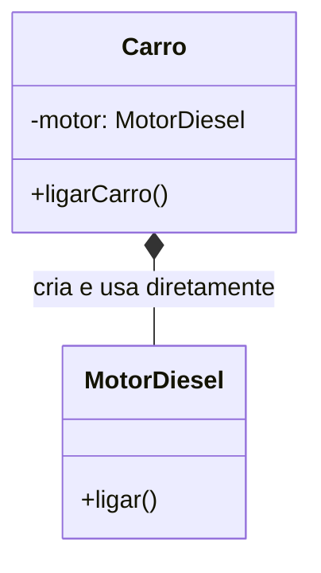
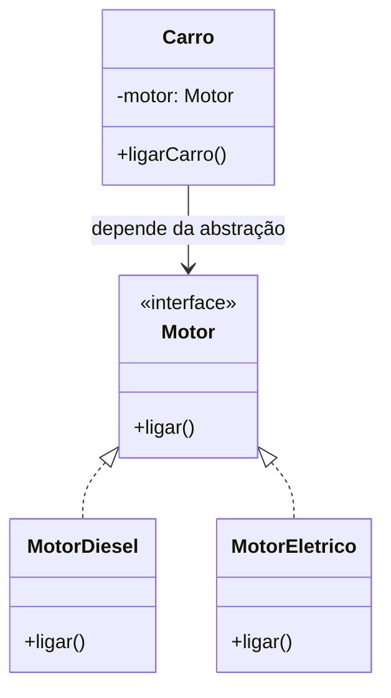

# 1. Alto Acoplamento

## 🎯 O Problema (a dor)

Você acabou de herdar um sistema legado. Precisa trocar o banco de dados de Oracle para PostgreSQL. Simples, certo? Errado. Você abre o código e percebe que a classe `PedidoService` instancia `OracleRepository` diretamente dentro dela. Que instancia `ConexaoOracle` diretamente. Que chama `XMLParserAntigo` diretamente. Mudar **uma** peça quebra **todas** as outras.

O gerente aparece e diz a frase mais famosa da engenharia de software brasileira:

> *"Não mexe nisso que ninguém sabe o que acontece."*

Isso é **alto acoplamento**: classes tão grudadas entre si que uma mudança em qualquer ponto propaga dano para o restante do sistema. O código para de ser uma coleção de peças — e vira um bloco de concreto.

---

## 🌍 A Analogia

Imagine um carro fabricado com o **motor soldado na carroceria**.

Não tem parafuso. Não tem encaixe. O motor diesel foi literalmente fundido junto com o chassi na fábrica.

- Quer testar o motor separado? Não dá — você precisa levar o carro inteiro.
- Quer trocar para motor elétrico? Não dá — vai ter que desmontar o carro peça por peça.
- O motor apresentou defeito? O carro todo fica parado.

Agora imagine um carro com um **compartimento de motor padronizado**: qualquer motor que respeite o encaixe (diesel, elétrico, híbrido) pode ser plugado. O carro não liga porque encontrou *um* motor — ele liga porque encontrou *algo que funciona como motor*.

Alto acoplamento = motor soldado.
Baixo acoplamento = compartimento padronizado.

---

## 📐 Diagrama UML — Antes (acoplado)



> O `Carro` conhece **quem** é o motor e **como criá-lo**. Dependência concreta, sem saída.

## 📐 Diagrama UML — Depois (desacoplado)



> O `Carro` agora depende de um **contrato** (`Motor`), não de uma implementação. Qualquer coisa que implemente `Motor` serve.

---

## 💻 Implementação em Java

### ❌ Exemplo ruim — alto acoplamento

```java
class MotorDiesel {
    public void ligar() {
        System.out.println("Motor diesel ligado");
    }
}

class Carro {
    // Preso à implementação concreta — cria E usa o motor
    private MotorDiesel motor = new MotorDiesel();

    public void ligarCarro() {
        motor.ligar();
    }
}

public class Main {
    public static void main(String[] args) {
        Carro carro = new Carro();
        carro.ligarCarro(); // Motor diesel ligado
    }
}
```

**Problemas:**
- `Carro` sabe *qual* motor usar e *como* criá-lo — duas responsabilidades que não são dele.
- Para testar `Carro`, você é obrigado a instanciar `MotorDiesel` junto.
- Trocar para `MotorEletrico` exige abrir e modificar `Carro`.

---

### ✅ Exemplo correto — baixo acoplamento via DIP + DI

```java
// Contrato: o Carro só precisa saber disso
interface Motor {
    void ligar();
}

class MotorDiesel implements Motor {
    @Override
    public void ligar() {
        System.out.println("Motor diesel ligado");
    }
}

class MotorEletrico implements Motor {
    @Override
    public void ligar() {
        System.out.println("Motor elétrico silenciosamente ligado");
    }
}

// Motor falso para testes — sem efeito colateral
class MotorFake implements Motor {
    public boolean foi_ligado = false;

    @Override
    public void ligar() {
        foi_ligado = true;
    }
}

class Carro {
    private final Motor motor;

    // Injeção de dependência: quem monta o carro decide o motor
    public Carro(Motor motor) {
        this.motor = motor;
    }

    public void ligarCarro() {
        motor.ligar();
    }
}

public class Main {
    public static void main(String[] args) {
        // Produção: motor elétrico
        Carro tesla = new Carro(new MotorEletrico());
        tesla.ligarCarro(); // Motor elétrico silenciosamente ligado

        // Produção: motor diesel
        Carro caminhao = new Carro(new MotorDiesel());
        caminhao.ligarCarro(); // Motor diesel ligado

        // Teste: motor fake, sem I/O real
        MotorFake fake = new MotorFake();
        Carro carroTeste = new Carro(fake);
        carroTeste.ligarCarro();
        System.out.println("Motor foi ligado? " + fake.foi_ligado); // true
    }
}
```

---

## 🏢 Como isso aparece em sistemas Spring Boot

```java
// ❌ Ruim — acoplamento concreto
@Service
public class PedidoService {
    private OracleRepository repository = new OracleRepository(); // preso ao Oracle
}

// ✅ Correto — depende da abstração; Spring injeta a implementação
@Service
public class PedidoService {
    private final PedidoRepository repository;

    public PedidoService(PedidoRepository repository) {
        this.repository = repository;
    }
}
```

O Spring é um **container de DI**: ele conhece as implementações concretas e as injeta em quem precisa. Sua classe de negócio não precisa saber se o banco é Oracle, PostgreSQL ou H2 de testes.

---

## ⚖️ Trade-offs

**Use abstrações (baixo acoplamento) quando:**
- A implementação pode mudar (banco de dados, API externa, serviço de e-mail).
- Você precisa testar a classe isoladamente com um *fake* ou *mock*.
- Mais de uma implementação coexiste no sistema (ex: pagamento Pix e cartão).
- O time é grande e módulos são desenvolvidos em paralelo.

**Evite a over-engenharia quando:**
- A implementação é única e não vai mudar (criar `interface SomadorDeInteiros` para `SomadorDeInteirosPadrao` é burocracia pura).
- O projeto é um script simples ou POC descartável.
- A abstração cria mais confusão do que clareza.

**Code smells que o alto acoplamento cria:**
- `new ConcreteClass()` dentro de outra classe de negócio.
- Classes que importam dezenas de outras classes concretas.
- Teste que precisa subir um servidor inteiro para rodar.
- Mudança simples exige alterações em cascata em múltiplos arquivos.

---

## 🔗 Padrões relacionados

| Padrão | Relação |
|---|---|
| **Dependency Injection** | A técnica direta para resolver alto acoplamento: entregue dependências em vez de instanciá-las. |
| **DIP (SOLID)** | O princípio que fundamenta a solução: dependa de abstrações, não de concretudes. |
| **Factory / Abstract Factory** | Quando a criação dos objetos concretos é complexa, use uma factory em vez de `new` espalhado. |
| **Facade** | Reduz acoplamento externo encapsulando um subsistema complexo por trás de uma interface simples. |

---

## 🧱 Conexão com SOLID

O alto acoplamento viola diretamente **dois princípios**:

**DIP — Dependency Inversion Principle**
> *"Módulos de alto nível não devem depender de módulos de baixo nível. Ambos devem depender de abstrações."*

`Carro` (alto nível) dependendo de `MotorDiesel` (baixo nível) é a violação clássica. A correção é fazer ambos dependerem da interface `Motor`.

**OCP — Open/Closed Principle**
> *"Entidades devem estar abertas para extensão e fechadas para modificação."*

Com acoplamento concreto, adicionar `MotorHibrido` obriga a modificar `Carro`. Com a interface, você apenas cria `MotorHibrido implements Motor` — `Carro` nem sabe que a nova classe existe.

**SRP — Single Responsibility Principle**
Quando `Carro` cria seu próprio `MotorDiesel` com `new`, ele acumula duas responsabilidades: *usar* o motor e *decidir qual motor usar*. Injetar a dependência devolve ao `Carro` apenas sua responsabilidade real.
