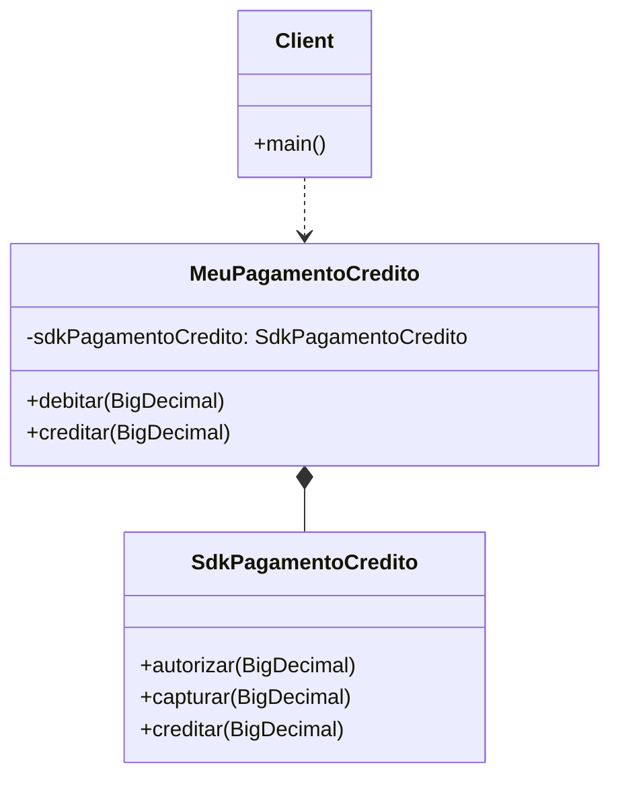
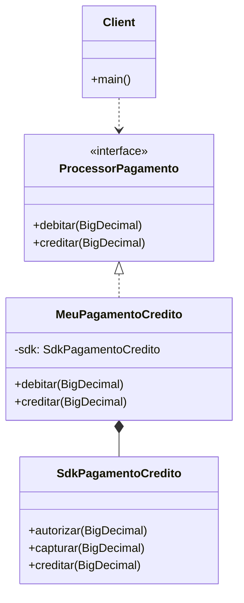

# 🔌 Adapter — A história contada pelos dois arquivos

Os dois arquivos (`Adapter_1.java` e `Adapter_2.java`) contam **a mesma história em dois capítulos**: o `Adapter_1` mostra a ideia bruta (a "simplificação"), e o `Adapter_2` mostra o padrão **como o GoF realmente desenha** — com `Target` no lugar certo. Vou desenrolar o porquê.

---

## 1. 🎯 A Dor

Imagina que você está construindo um sistema de checkout e o time decidiu: **toda forma de pagamento vai ter `debitar()` e `creditar()`**. Bonito, uniforme, fácil de testar.

Aí chega o gateway de cartão de crédito — uma SDK fechada (você nem tem o código-fonte, é um `.jar` no Maven). E ela fala outro idioma:

```
autorizar()   →   reserva o valor no cartão
capturar()    →   efetiva a cobrança
creditar()    →   estorna
```

Não existe `debitar()`. Para debitar de verdade, você precisa fazer `autorizar()` **e depois** `capturar()`. Duas chamadas, em ordem, sempre juntas.

**A tentação ruim:** espalhar isso pelo sistema. Cada lugar que cobra cartão chama as duas. Resultado:

- 🤢 **Duplicação:** a sequência `autorizar → capturar` se repete em todo canto.
- 🤢 **Acoplamento ao fornecedor:** seu código de negócio sabe que existe uma SDK chamada `SdkPagamentoCredito`. Trocar de gateway amanhã? Caçar todas as referências.
- 🤢 **Vocabulário inconsistente:** Pix fala `debitar`, boleto fala `pagar`, cartão fala `autorizar+capturar`. O cliente do código tem que conhecer o dialeto de cada um.

---

## 2. 🌍 A Analogia

Você comprou um notebook nos EUA. Plugue chato, dois pinos planos. Voltou para o Brasil — tomada redonda, três furos. Você tem duas opções:

1. **Trocar o plugue do notebook** (mexer na SDK — impossível, é fechada).
2. **Comprar um adaptador** — uma peça que **encaixa no plugue americano de um lado e na tomada brasileira do outro**.

O adaptador não gera energia. Ele só **traduz formatos**. É exatamente isso que `MeuPagamentoCredito` faz: encaixa-se na SDK do gateway de um lado, e expõe a interface que o seu sistema espera do outro.

---

## 3. 📐 UML — onde os dois arquivos divergem

### `Adapter_1.java` — a versão "simplificada" (sem o Target)



Funciona. Resolve a duplicação. Mas o cliente **depende da classe concreta** `MeuPagamentoCredito`. Você não pode trocar por outra forma de pagamento sem mudar o tipo da variável.

### `Adapter_2.java` — o desenho do GoF (com Target)



Agora os papéis do GoF estão todos no palco:

| Papel GoF | No seu código |
|---|---|
| **Client** | `main()` |
| **Target** (a interface que o cliente espera) | `ProcessorPagamento2` |
| **Adapter** (faz a tradução) | `MeuPagamentoCredito2` |
| **Adaptee** (quem está sendo adaptado) | `SdkPagamentoCredito2` |

**O `Adapter_1` não tem Target.** É por isso que ele não está no livro: sem Target, o cliente continua casado com o Adapter concreto. O padrão GoF existe justamente para que o cliente **dependa de uma abstração**, não da classe que faz a tradução.

---

## 4. 💻 Por que a linha-chave do `Adapter_2` muda tudo

Olha esta linha:

```java
ProcessorPagamento2 credito = new MeuPagamentoCredito2();
```

O tipo declarado é a **interface**, não a classe. Isso quer dizer que amanhã, se chegar um Pix, um boleto, um gateway novo, basta:

```java
ProcessorPagamento2 credito = new MeuPagamentoPix();
ProcessorPagamento2 credito = new MeuPagamentoBoleto();
ProcessorPagamento2 credito = new MeuPagamentoStripe(); // outra SDK, outra tradução
```

O `main` (e qualquer código que receba `ProcessorPagamento2` como parâmetro) **não muda uma vírgula**. Cada nova forma de pagamento é um **novo adapter** que traduz a SDK dele para o seu vocabulário comum.

No `Adapter_1`, se você quiser fazer isso, tem que mexer no tipo da variável e em todos os lugares que ela é passada. **O cliente está acoplado ao adapter, em vez de à abstração.**

---

## 5. ⚖️ Trade-offs

**Use Adapter quando:**

- Você precisa integrar uma biblioteca/SDK de terceiros cuja API não bate com a sua.
- Tem código legado com nomes esquisitos e quer "embalar" para o vocabulário novo.
- Quer **uniformizar várias APIs heterogêneas** sob uma interface só (cartão, Pix, boleto, PayPal → todos `ProcessorPagamento`).

**Evite quando:**

- A API original já é boa e você está adaptando só por estética. Adapter cobra um preço: mais uma camada, mais um arquivo.
- Você consegue **mudar a API original**. Se o código é seu, conserta lá em vez de embrulhar.
- Você na verdade quer **adicionar comportamento** (logging, cache, retry). Aí o padrão certo é **Decorator**, não Adapter.

**Cheiros que ele resolve:**

- Métodos que aparecem em sequência sempre juntos (`autorizar` + `capturar`).
- Código de negócio importando classes de SDK direto.
- `if (gateway == "stripe") ... else if (gateway == "paypal") ...` — sintoma de falta de Target unificado.

**Cuidados:**

- **Adapter é tradução, não invenção.** Se o `debitar` precisa fazer validação de saldo, log de auditoria e enviar e-mail, isso **não é Adapter** — é Service Layer ou Decorator. Mantenha o Adapter magrinho.
- Adapter de **classe** (via herança) existe no GoF, mas em Java sem herança múltipla, o Adapter de **objeto** (composição, como nos dois arquivos) é o caminho.

---

## 6. 🔗 Padrões vizinhos

- **Facade** — também simplifica uma API complicada, mas a intenção é diferente: Facade **esconde complexidade interna** (várias classes do seu próprio sistema viram uma porta de entrada simples). Adapter **traduz** entre dois mundos que já existem com formatos diferentes.
- **Decorator** — tem a mesma forma de composição (`MeuPagamento` envolve `Sdk`), mas o Decorator preserva a interface e **adiciona comportamento**; o Adapter **muda a interface** sem adicionar funcionalidade nova.
- **Bridge** — parente conceitual, mas é planejamento **prévio**: você projeta para que abstração e implementação variem livres desde o início. Adapter é remendo **depois** que descobriu que duas coisas precisam conversar.

---

## 7. 🧱 Conexão com SOLID

O `Adapter_2` está cheio de SOLID respeitado — é o que falta no `Adapter_1`:

- **DIP (Dependency Inversion):** o `main` depende de `ProcessorPagamento2` (abstração), não de `MeuPagamentoCredito2` (concreta). No `Adapter_1`, o `main` depende da classe concreta direto — **viola DIP**.
- **OCP (Open/Closed):** quer adicionar Pix? Cria `MeuPagamentoPix implements ProcessorPagamento2`. O código existente **não é modificado**, só estendido. No `Adapter_1`, não dá: não tem onde "implementar".
- **SRP (Single Responsibility):** `MeuPagamentoCredito2` tem uma única razão para mudar — se a SDK do cartão mudar. Lógica de negócio fica fora dela.
- **LSP (Liskov):** qualquer implementação de `ProcessorPagamento2` pode substituir outra sem o cliente saber. É o que torna `ProcessorPagamento2 credito = new ...` poderoso.

---

## TL;DR — a diferença entre os dois arquivos

| | `Adapter_1` | `Adapter_2` (GoF) |
|---|---|---|
| Tem `Target` (interface)? | ❌ Não | ✅ `ProcessorPagamento2` |
| Cliente depende de abstração? | ❌ Classe concreta | ✅ Interface |
| Posso trocar a forma de pagamento sem mexer no cliente? | ❌ Não | ✅ Sim |
| Respeita DIP e OCP? | ❌ Não | ✅ Sim |
| Está no livro do GoF? | ❌ Não (é a "ideia") | ✅ Sim (é o padrão) |

O `Adapter_1` resolve **a dor da SDK estranha**. O `Adapter_2` resolve **a dor da SDK estranha + a dor do acoplamento**. Por isso o GoF insiste no Target: sem ele, você só fez uma classe wrapper bonitinha — não um padrão reutilizável.
